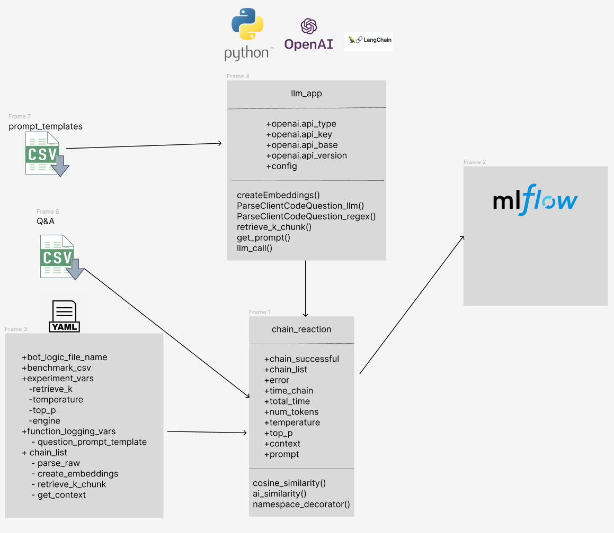

# Chain Reaction - Experimentation Tool for LLMs

`Chain Reaction` is a simple Python based experimentation tool to quickly iterate on an LLM applications. From a `config.yaml` file, we define which internal variables to log, and which evaluation metrics to compute on a set of benchmark question/answer(s) from a `.csv`. Experiments are logged using `MLFlow` for ease of analysis.

A principle behind the design of `Chain Reaction` is to minimize code integration with an LLM app as one experiments with functions like retrieving, parsing, answering, etc. in a chain. Metrics like cosine similarity and AI similarity are used to evaluate the performance of your LLM app on a set of pre-defined benchmark questions. 

Some current limitations and assumptions:
- chains are sequenced with Python functions and not inner calls of langchain/semantic_kernel
- input/output of each function must be string or tuple (no dictionary)
- desired variables to be logged within the scope of a function must be defined as a variable in `locals()` since we are retrieving from the stack
- desired variables to be logged within the scope of a function must not be lists, dictionaries or objects.



## Setup

```cmd
chain-reaction                            
|---chain_reaction.py            
│---config.yaml                  
│---environment.yaml              
│---evals.py                     
├───bot                          
    │---example.env         
    │---llm_app.py                
    │---benchmark_QA.csv         
    │---prompt_templates.csv         
```

> NOTE: Some other example connections with custom databases and integrations with openai like `llm_app.py` are presented here: [AzureDataRetrievalAugmentedGenerationSamples](https://github.com/microsoft/AzureDataRetrievalAugmentedGenerationSamples/tree/main/Python). 

1. Install miniconda and create a virtual environment
```bash
conda env update -f environment.yaml
```
2. Place relevant bot files like `.env`, `.py` into the folder named `/bot`
3. Update the `.env` file to include OpenAI embedding models
4. Install requirements for your bot
5. Update the `config.yaml` with your `llm_app_file_name` from the `/bot` folder
6. Place `.csv` of benchmark Q&A in the folder named `/bot`

| Question      | Answer |
| ----------- | ----------- |
| Michelle's mom has four children. The first child is named April, the second is named May and the third is named June. What is the name of her fourth child? | Michelle's fourth child is named July. |
| How do airplane wings allow planes to fly? | The top part of an airplane wing is curved while the bottom is flat, and because the air stream passes from one edge of the wing to the other in equal periods of time, this leads to a lower pressure on the top of the wing than on the bottom of the wing. The accompanying pressure difference (according to Bernoulli's principle) creates the lift force that gives the plane lift and helps it get off the ground. |

7. Update the `config.yaml` with your `benchmark_csv` from the `/bot` folder
8. Define the `input_var` in `config.yaml` for your LLM message variable name in case your initial function in the chain sequence takes different inputs
9. Update the `config.yaml` with the in/out variable names in your chain sequence
10. Update the `config.yaml` with any `experiment_vars` you want to set as args for functions
11. Update the `config.yaml` with variable names you want to log from function scopes under `internal_logged_vars`

Example config file below:
```yaml
lm_app_file_name: llm_app.py
benchmark_csv: benchmark_QA.csv
env_file_name: llm_env.env
mlflow_experiment_name: Default
evaluation_metrics:
  cosine_similarity: true
  ai_similarity: false
input_var: msg
experiment_vars:
internal_logged_vars:
  - intermediate_ans
  - prompt_template_1
  - prompt_template_2
chain_instruct:
  - fxn_name: test_two_prompt
    in:
      - msg
    out:
      - ans
```

> NOTE: Writing a single main function for your LLM app allows you to simply define your experiment variables in code, and simplify your config file. However, make sure sure to add the variables of interest to log in the `internal_logged_vars`. Currently logging variables in nested functions are not currently supported. Below is an example of a config file that sequences individual functions and allows you to define argument variables from `experiment_vars`.

```yaml
llm_app_file_name: llm_app.py
benchmark_csv: benchmark_QA.csv
env_file_name: llm_env.env
mlflow_experiment_name: Default
evaluation_metrics:
  cosine_similarity: true
  ai_similarity: false
input_var: msg
experiment_vars:
  prompt_templates_name: prompt_templates.csv
  prompt_id_a: 0
  prompt_id_b: 1
internal_logged_vars:
  - engine
chain_instruct:
  - fxn_name: get_prompt_template
    in:
      - prompt_id_a
      - prompt_templates_name
    out:
      - prompt_template_a
  - fxn_name: llm_call
    in:
      - msg
      - prompt_template_a
    out:
      - intermediate_ans
  - fxn_name: get_prompt_template
    in:
      - prompt_id_b
      - prompt_templates_name
    out:
      - prompt_template_b
  - fxn_name: llm_call
    in:
      - msg
      - prompt_template_b
      - intermediate_ans
    out:
      - ans
```

## Usage

After updating your `config.yaml`, run the following command to loop through the benchmark Q&A csv and report out the results `MLFlow`. You can also specify a different config file by using the optional flag `--config=<insert_name>.yaml`.

```bash
python chain_reaction.py
```

> NOTE: There is some error handling with running a function call and if it fails to run, the remaining sequence will not complete. The next question will be prepped and evaluated instead. The logs will be missing information when this happens.

Once the results are complete, you will be able review your experiment alongside other ones in `MLFlow`. The cleanest view of the results are actually in a csv and a preview can be found in `MLFlow`.

```bash
mlflow ui
```


## Adding New Metrics

In `evals.py`, simply add a new function and then import it directly in `chain_reaction.py`. We will need to add some logic to allow a user to specify the new metric in `config.yaml` based on true/false. 

## Contributing

This project welcomes contributions and suggestions.  Most contributions require you to agree to a
Contributor License Agreement (CLA) declaring that you have the right to, and actually do, grant us
the rights to use your contribution. For details, visit https://cla.opensource.microsoft.com.

When you submit a pull request, a CLA bot will automatically determine whether you need to provide
a CLA and decorate the PR appropriately (e.g., status check, comment). Simply follow the instructions
provided by the bot. You will only need to do this once across all repos using our CLA.

This project has adopted the [Microsoft Open Source Code of Conduct](https://opensource.microsoft.com/codeofconduct/).
For more information see the [Code of Conduct FAQ](https://opensource.microsoft.com/codeofconduct/faq/) or
contact [opencode@microsoft.com](mailto:opencode@microsoft.com) with any additional questions or comments.

## Trademarks

This project may contain trademarks or logos for projects, products, or services. Authorized use of Microsoft 
trademarks or logos is subject to and must follow 
[Microsoft's Trademark & Brand Guidelines](https://www.microsoft.com/en-us/legal/intellectualproperty/trademarks/usage/general).
Use of Microsoft trademarks or logos in modified versions of this project must not cause confusion or imply Microsoft sponsorship.
Any use of third-party trademarks or logos are subject to those third-party's policies.
